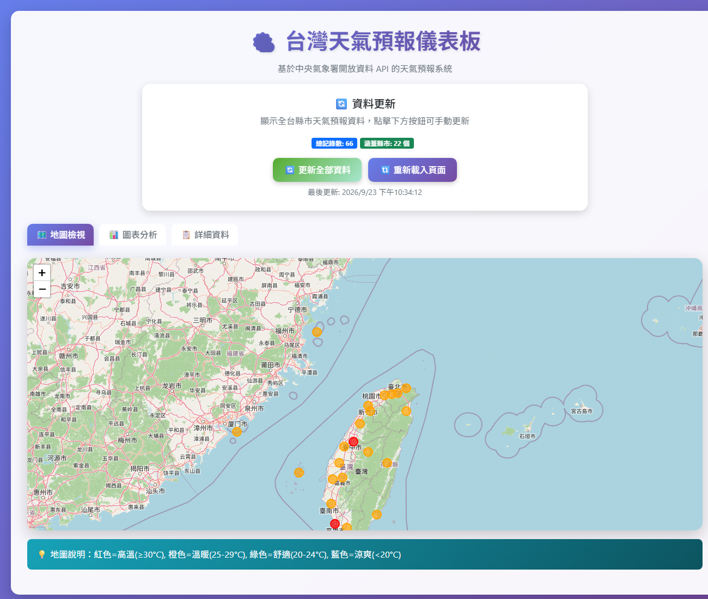
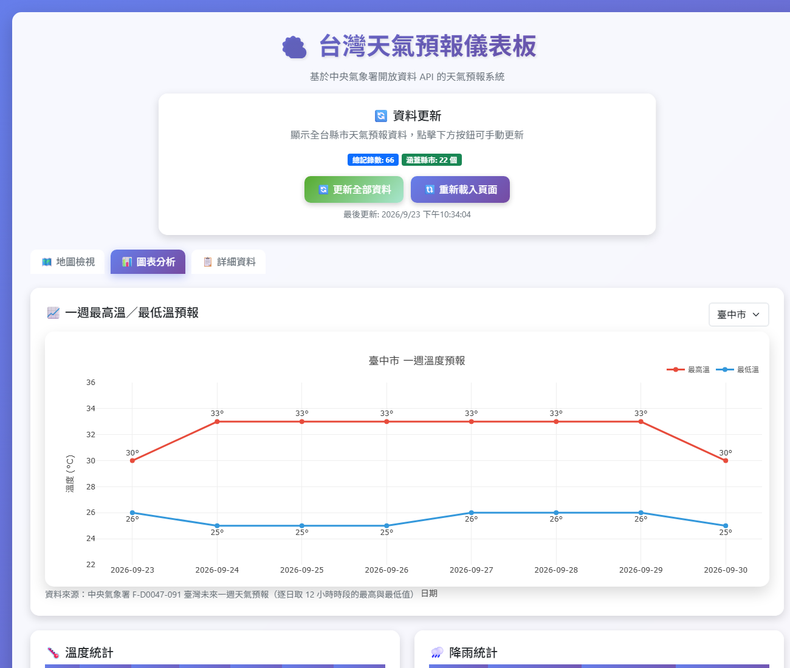
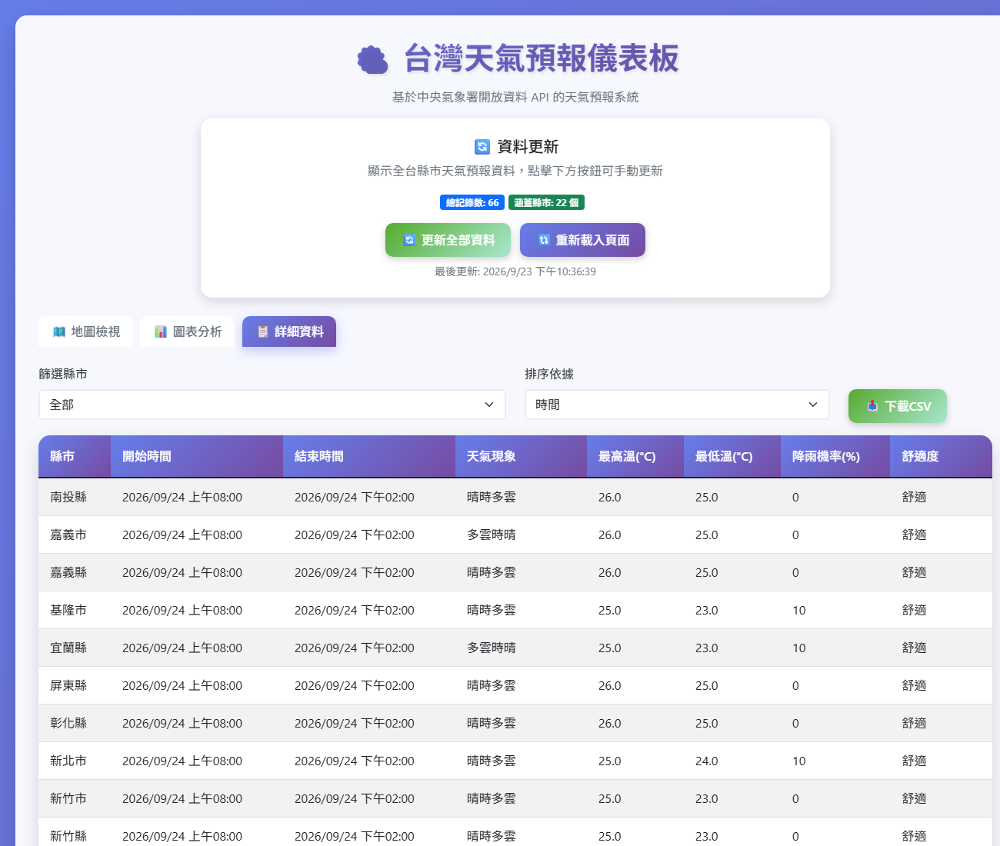

# 🌤️ L3_CWAv2 - 台灣天氣預報儀表板

> **課程**: AIOT-DA  
> **作業**: L3 - 中央氣象署 API 應用 v2  
> **開發時間**: 2026 年 9 月  
> **技術棧**: Python, Flask, Folium, Plotly.js, Bootstrap 5, SQLite, Vercel  

- **線上展示**: [https://l3cwav2liaochiahui.vercel.app](https://l3cwav2liaochiahui.vercel.app)
- **GitHub**: [https://github.com/babyish23/L3_CWAv2](https://github.com/babyish23/L3_CWAv2)

## 📋 專案概述

串接中央氣象署開放資料 API，把全台 22 縣市的天氣預報做成網頁儀表板，包含：

- 🗺️ **地圖檢視（首頁預設）**：Folium 地圖標出各縣市目前溫度，依溫度分色
- 📈 **圖表分析**：各縣市一週逐日最高溫／最低溫折線圖，可切換縣市（預設臺中市）
- 📊 **統計表**：各縣市 36 小時內溫度與降雨機率的平均／最大／最小值
- 📋 **詳細資料**：完整預報表格，可篩選縣市、排序、下載 CSV
- 🔄 **一鍵更新**：一次向 API 抓取全台 22 縣市最新預報

## 🖼️ 成果畫面

### 地圖檢視（首頁）



### 圖表分析：一週最高溫／最低溫



### 詳細資料



## 🏗️ 系統架構

```
L3_CWAv2/
├── app.py                     # Flask 網頁應用（Vercel 部署的進入點）
├── weather_api.py             # 中央氣象署 API 串接與資料解析
├── database.py                # SQLite 資料存取
├── templates/
│   ├── index.html             # 主頁面（三個分頁）
│   └── error.html             # 錯誤頁面
├── public/static/             # 靜態檔（Vercel 由 CDN 提供，本機由 Flask 提供）
│   ├── css/style.css
│   └── js/app.js              # 前端邏輯：載入資料、畫圖表、表格篩選
├── requirements.txt           # 部署用套件（精簡）
├── requirements-streamlit.txt # 本機 Streamlit 版本額外需要的套件
├── streamlit_app.py           # 早期 Streamlit 原型
└── docs/screenshots/          # 報告截圖
```

資料流程：

```
中央氣象署 API ──► weather_api.py 解析 ──► SQLite ──► Flask API ──► 瀏覽器 (Plotly.js / Folium / 表格)
   F-C0032-001 (36 小時預報)          │
   F-D0047-091 (一週預報) ────────────┘ 記憶體快取 30 分鐘
```

## 🔌 使用的資料集

| 資料集 | 內容 | 用途 |
|--------|------|------|
| F-C0032-001 | 今明 36 小時天氣預報（3 個時段） | 地圖、統計表、詳細資料 |
| F-D0047-091 | 臺灣未來一週天氣預報（12 小時一個時段） | 一週溫度折線圖 |

不帶 `locationName` 參數時，一次請求就能拿到全台 22 縣市，不需要逐一呼叫。

## 🚀 開發流程

### 階段一：Streamlit 原型

先用 Streamlit 快速驗證 API 串接、SQLite 儲存、Plotly 圖表與 Folium 地圖（`streamlit_app.py`）。

### 階段二：改寫成 Flask 以部署到 Vercel

老師要求部署到 Vercel，而 Vercel 不支援 Streamlit 這類需要常駐連線的應用，因此改寫成 Flask：

| Streamlit 寫法 | Flask 版本 |
|----------------|------------|
| `st.selectbox()` | HTML `<select>` + JavaScript |
| `st.plotly_chart()` | 前端 Plotly.js 直接畫圖 |
| `st_folium()` | 後端產生 Folium HTML，前端嵌入 |
| `st.download_button()` | `/api/download-csv` 端點 |

### API 端點

```
GET /                         主頁面
GET /api/weather-data         36 小時預報資料 + 統計
GET /api/weekly-temperature   各縣市一週逐日最高／最低溫
GET /api/update-weather       重新抓取全台最新預報
GET /api/weather-map          Folium 地圖 HTML
GET /api/download-csv         下載 CSV
```

## 💻 技術實作重點

### 一週溫度：把 12 小時時段整理成逐日資料

一週預報每 12 小時一個時段，同一天會有白天和晚上兩筆，因此每天取最高溫的最大值、最低溫的最小值：

```python
max_daily = df[df['field'] == 'max_temp'].groupby(['location', 'date'])['value'].max()
min_daily = df[df['field'] == 'min_temp'].groupby(['location', 'date'])['value'].min()
```

### 前端畫圖

後端只回傳數字陣列，由瀏覽器用 Plotly.js 繪製，並在切換縣市時重畫：

```javascript
Plotly.newPlot(chartDiv, [
    { x: series.dates, y: series.max_temp, name: '最高溫', mode: 'lines+markers+text' },
    { x: series.dates, y: series.min_temp, name: '最低溫', mode: 'lines+markers+text' }
], layout, { responsive: true });
```

### 資料庫避免重複

`weather_forecast` 表以（縣市, 開始時間, 結束時間）為唯一鍵，更新時用 `INSERT OR REPLACE` 覆蓋成最新預報。

## 🧯 遇到的問題與解法

| 問題 | 原因 | 解法 |
|------|------|------|
| Vercel 部署出現 `Secret "cwa_api_key" does not exist` | `vercel.json` 用 `@cwa_api_key` 引用了不存在的 Secret | 移除該設定，改在 Vercel 專案的 Environment Variables 直接新增 `CWA_API_KEY` |
| 部署成功但網站全部 404 | `vercel.json` 把所有網址改寫到 `/api/index`，Flask 收到的路徑對不到任何路由 | 刪除 `vercel.json`，讓 Vercel 的 Flask 預設直接執行根目錄的 `app.py` |
| Vercel 上無法寫入資料庫 | Vercel 的程式目錄是唯讀的 | 在 Vercel 上把 SQLite 放到 `/tmp`，冷啟動時自動向 API 抓一次資料 |
| 折線圖只出現空白座標軸 | `plotly-latest.min.js` 其實停在 1.x 舊版，看不懂新版 Python Plotly 輸出的二進位數字格式 | 改用固定版本 Plotly.js 2.35，並由前端直接用數字陣列畫圖 |
| 詳細資料的時間多了 8 小時 | Flask 把沒有時區的時間標成 GMT，瀏覽器再轉成台灣時間 | API 改傳當地時間字串 |
| 部署套件過大（約 370 MB） | 部署時連 Streamlit 一起安裝 | Streamlit 相關套件移到 `requirements-streamlit.txt` |

## 🔧 部署與執行

### Vercel 部署

1. 在 Vercel 用 GitHub 帳號登入，Import `babyish23/L3_CWAv2`
2. Application Preset 選 **Flask**，Root Directory 維持 `./`
3. 到 **Settings → Environment Variables** 新增 `CWA_API_KEY`（值為氣象署授權碼）
4. 之後每次 `git push` 到 `main` 都會自動重新部署

### 本機執行

```bash
pip install -r requirements.txt
echo CWA_API_KEY=你的API金鑰 > .env
python app.py            # 開啟 http://localhost:5000
```

Streamlit 原型：

```bash
pip install -r requirements-streamlit.txt
streamlit run streamlit_app.py
```

## 🎯 學習心得

1. **API 串接**：理解氣象署兩種資料格式（36 小時與一週預報結構不同），並整理成統一的 DataFrame
2. **框架選擇**：Streamlit 開發快，但無法部署到 Vercel 這種無伺服器平台，需要改寫成 Flask
3. **無伺服器部署的限制**：唯讀檔案系統、冷啟動、套件大小限制，都會影響程式設計
4. **除錯方法**：從回應大小、回應標頭判斷 404 是 Vercel 還是 Flask 回的，比盲目改設定有效

## 🔮 未來改進方向

- 加入天氣警特報通知
- 改用雲端資料庫保存歷史預報，做預報與實際觀測的比較
- 一週圖表加入降雨機率與多縣市對比

---

本專案僅供學習用途。天氣資料來源為中央氣象署開放資料平台，請遵守其使用條款。
